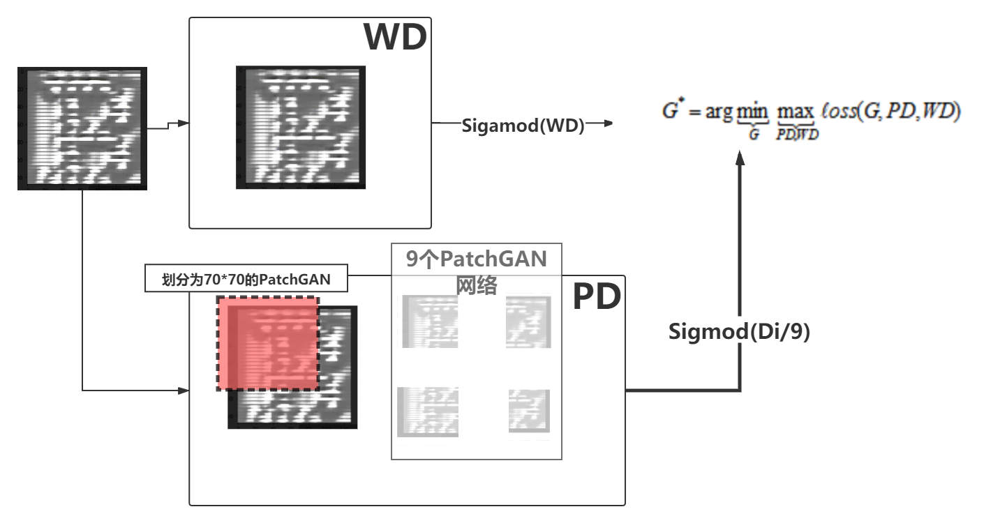

## Cycle-GAN Fontstyle 
<tbd>@作者:ECUST WCK</tbd>
<tbd>@作者:ECUST CLF</tbd>
<tbd>@导师：应方立</tbd>

## 项目简介

本项目为<<计算机图像处理>>课程项目。核心内容为通过Pytorch框架下GAN对抗网络，对自然字体风格数据集进行训练后，得到的模型可以通过少量字母风格模仿生成完整字体风格。核心技术为Pytorch下实现的CycleGAN对抗网络，通过Ɠenerater生成器和Ɗiscriminater判别器生成随机数据并进行判别以提高模型精确度。

